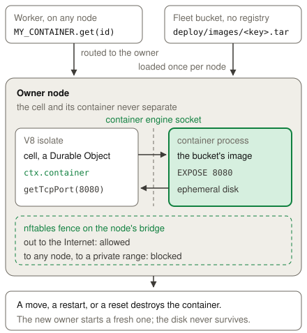

# Containers

A container runs a program that is not JavaScript beside the Worker that needs
it. A Durable Object supervises that program, so the object starts the
container, reaches it over a TCP port, and stops it. An application uses a
container for a language or a dependency that the Workers runtime does not
have, for a heavy computation, or for code that a customer supplies. The
container disk is ephemeral, therefore durable state belongs in the object's
storage or in another binding. Containers are experimental in celld, so the
configuration keys, the `ctx.container` surface, the node-side defaults, and the
security boundary can change without notice. Read the
[Cloudflare Containers documentation](https://developers.cloudflare.com/containers/)
for the standard API behavior.

## Example

The [Containers example](../../examples/container) starts a Python HTTP server
and reaches it through a container port.

<!-- celld-example: container -->

## The object and its container

A `containers` entry names a Durable Object class, and each object of that class
controls at most one container. The class must be SQLite-backed, and it must
belong to the same script. celld gives such an object a `ctx.container` handle,
and an object of any other class has none. A Worker therefore addresses a
container the way it addresses an object, with a name or an id.

celld implements `running`, `start()`, `monitor()`, `destroy()`, `signal()`,
`getTcpPort()`, `exec()`, and `setInactivityTimeout()`. `start()` accepts
`entrypoint`, `env`, `enableInternet`, and `labels`. It checks `hardTimeout`
and then ignores it, so a value of 0 or less throws and a valid value changes
nothing. `inspect()`, the snapshot methods, and the outbound interception
methods reject with an error. Read the
[`ctx.container` reference](https://developers.cloudflare.com/durable-objects/api/container/)
for the standard method list.

A request reaches the container through a port, and not through a public
address. `getTcpPort(port).fetch()` opens a connection from the node to the
container and speaks HTTP on it. On Linux, the node uses the container's bridge
address, so every port works. On macOS, the node uses a published loopback port,
so the image must declare the port with `EXPOSE`, as `wrangler dev` requires. A
fetch with an `Upgrade: websocket` header gives a 101 response with a
`webSocket`, as on Cloudflare. `getTcpPort(port).connect()` gives a raw socket
with the lifetime of the event that opened it. See
[TCP sockets](../cloudflare-compat.md#tcp-sockets).

A `monitor()` promise and an `exec()` process have that same event lifetime.
They settle only inside the event that created them, and after the handler
answers they do not keep the object active, so a drain can move the object.
`running` always reports the engine's state, therefore an object that lost its
`monitor()` sees the exit at its next event. A `start()` that fails is logged by
the node as `container_start_failed`.

`@cloudflare/containers` runs as published, and the example above uses it. Its
`sleepAfter` alarm stops the container, and `getContainer()`, `getRandom()`, and
`switchPort()` work. Read the
[Container class reference](https://developers.cloudflare.com/containers/reference/container-class/)
for the hooks and the defaults. `@cloudflare/sandbox` also runs as published, on
the `cloudflare/sandbox` image. Its `exec()` API, files, processes, sessions,
and code interpreter run inside the container, over the HTTP transport and over
the RPC transport. Preview URLs need a wildcard hostname at the operator's load
balancer, tunnels run cloudflared inside the container, and bucket mounts use
the credentials that the application passes. See the
[sandbox example](../../examples/sandbox).

## The image and the node

Cloudflare pushes an image to its own registry, distributes it across its
network, and starts the container in a virtual machine at
[the nearest location that already holds the image](https://developers.cloudflare.com/containers/concepts/architecture/).
An object and its container can therefore run in different places. celld has no
registry and no global network, so it builds the same two steps out of the fleet
bucket and the node's own container engine.

`celld deploy` builds a Dockerfile in the project, or it pulls an image
reference, with the `docker` CLI on `PATH` or with the CLI that `CELLD_DOCKER`
names. A Podman CLI works. `celld deploy` then saves the image to the fleet
bucket at `deploy/images/<key>.tar`, where the key hashes the image layers and
the image config. A node loads the image into its own engine the first time a
cell of the class starts, so a node never contacts a registry, and a redeploy of
an unchanged image uploads nothing. The `celld-fence` image that a node needs
rides with every deployment that has a container.

`celld deploy` builds and pulls for `linux/amd64`, as Wrangler does, so a deploy
from an ARM machine runs on x86-64 nodes. `CELLD_CONTAINER_PLATFORM` selects
another platform. `celld dev` builds for the local machine and keeps the image
in the local engine.

The container runs on the node that owns the cell, and the two never separate.
Each node that serves a container class therefore needs a Docker daemon or a
Podman daemon. celld uses the Unix socket that `DOCKER_HOST` names, or the
default socket of Docker, Docker Desktop, OrbStack, or Podman. A `DOCKER_HOST`
value that is not a `unix://` URL gives celld no socket at all. A node without
an engine cannot activate a cell of a container class, and it serves every other
class.

## The isolation boundary

Cloudflare runs each container in its own virtual machine, so Cloudflare
publishes no capability policy. Under the default runtime a celld container
shares the node's kernel, so celld sets a policy of its own. celld drops all
Linux capabilities, sets `no-new-privileges`, keeps the daemon's default seccomp
profile, limits the container to 1024 processes, and runs an init as PID 1 that
reaps an orphaned process. Two containers on one node cannot open connections to
each other.

The node fences its container bridges before the first container starts. The
rules are nftables rules on the node, outside every container and every runtime,
and celld installs them through the daemon with a one-shot privileged container
of the `celld-fence` image. A container with `enableInternet: true` reaches the
Internet and nothing of the node's own. It cannot open a connection to the node,
to another node, to the private ranges `10/8`, `172.16/12`, `192.168/16`, and
`100.64/10`, or to the link-local range, so the node's internal listener and a
cloud metadata service are both out of reach. A node that cannot install the
rules starts no container, and a deployment from a celld without the fence image
starts no container on a node that has the fence.

`enableInternet: false` attaches the container to an internal bridge with no
route out. On macOS, the node reaches a container only through a published port,
and an internal network publishes none, so `celld dev` on macOS keeps egress on
and logs a warning. The fence still applies.

`CELLD_CONTAINER_RUNTIME` names the OCI runtime for every container on the node,
for example `runsc` for gVisor or `kata` for a virtual machine. A `containers`
entry can also name a `runtime` of its own, which overrides the node setting for
that class. celld adds this key, and the Cloudflare configuration has no
equivalent. The daemon must have the named runtime, or every `start()` of such a
container fails with the daemon's error, so a class runs only where its
isolation exists. Under the default runtime, a container is a kernel namespace
boundary and not a virtual machine. For code that you did not write, name a
runtime that gives each container its own kernel, and keep the secrets in the
Worker.

A container that runs under a named runtime gets a written `/etc/resolv.conf`
with public resolvers, `1.1.1.1` and `1.0.0.1` by default, or the
`CELLD_CONTAINER_DNS` resolvers when the operator sets them. gVisor cannot reach
the container engine's built-in resolver, so a container under gVisor resolves
no hostname otherwise, and the fence permits the public resolver. A container on
the node's default runtime keeps the engine's resolver, unless the operator sets
`CELLD_CONTAINER_DNS`.

## Sleep, wake, and the node's resources

Cloudflare stops an idle container after 10 minutes, and `sleepAfter` changes
that window. celld keeps the same default and the same mechanism.
`setInactivityTimeout()` sets the window for the engine, and celld uses 10
minutes without one. An idle eviction of the cell keeps the container running
for that window, and the next activation of the cell on the same node reconnects
to it. A move to another node, a node restart, and a reset destroy the container
instead, so the container disk is ephemeral, as on Cloudflare. A node stop
destroys every container of the node, and Ctrl-C on `celld dev` does the same
while it keeps the local state.

`instance_type` sets the CPU limit and the memory limit of the Cloudflare
instance type with that name. celld accepts `lite` and its older name `dev`,
`basic`, `standard-1` and its alias `standard`, `standard-2`, `standard-3`, and
`standard-4`, with the values that
[the Cloudflare limits page](https://developers.cloudflare.com/containers/platform/limits/)
gives. An entry without an `instance_type` gets `dev`, a sixteenth of a CPU and
256 MiB, as on Cloudflare. A sixteenth of a CPU is a slow start for an
interpreter, so name a larger type when the image boots a runtime. celld does
not enforce the disk size of the type.

A container runs in its own cgroup, so the node process does not carry the
container's memory in its own charge. The node therefore counts the instance
type's memory cap of every running container as committed memory. A
container-heavy node reports no headroom and sheds cells, which keeps the node
away from the kernel out-of-memory killer. An operator must set the node memory
ceiling at or above the largest instance type in use, plus headroom.

`max_instances` caps the containers that one class runs across the fleet.
Cloudflare holds that cap centrally. celld has no coordinator, so each node
publishes its running container count per class in the shared capacity sample. A
node that is about to start a container sums that count across the fleet and
adds its own live count. A start over the cap fails, and the node logs
`container_start_failed` with the limit. The sample can lag one refresh,
therefore two nodes that start the same class at once can exceed the cap for a
moment and converge at the next refresh. `celld dev` reads no sample, so it
enforces no fleet cap.

## Differences from Cloudflare

- A `containers` entry accepts `class_name`, `image`, `name`, `instance_type`,
  `max_instances`, and `runtime`. Each other key stops the deployment. celld
  adds `runtime`, and it accepts `name` without using it.
- celld places a container on the node that owns the cell. Cloudflare can place
  a container away from its object.
- A node that serves a container class needs a Docker daemon or a Podman daemon.
- celld does not enforce the disk size of an instance type.
- `max_instances` converges across the fleet instead of holding centrally, so
  the fleet can exceed the cap for one refresh. `celld dev` enforces no cap.
- `inspect()`, `snapshotDirectory()`, `snapshotContainer()`, and the outbound
  interception methods reject with an error. `start()` checks `hardTimeout` and
  then ignores it, so a value of 0 or less throws and a valid value has no
  effect.
- `getTcpPort(port).connect()` gives a socket with the lifetime of the event
  that opened it. See [TCP sockets](../cloudflare-compat.md#tcp-sockets).
- A `monitor()` promise and an `exec()` process do not keep the object active
  after the handler answers.
- On macOS, the node reaches a container through a published port, so the image
  must declare the port with `EXPOSE`. `enableInternet: false` has no effect on
  macOS.
- The container bridges carry no IPv6 address, and the fence rejects the IPv6
  link-local and unique-local ranges as well.
- A move of an object to another node stops its container, so the first
  `@cloudflare/sandbox` call after the move can fail with the SDK's
  `OperationInterruptedError`, as after a container restart on Cloudflare. The
  next call starts a fresh container.

The [Cloudflare compatibility](../cloudflare-compat.md#services) page lists
the runtime APIs and the unsupported services.
