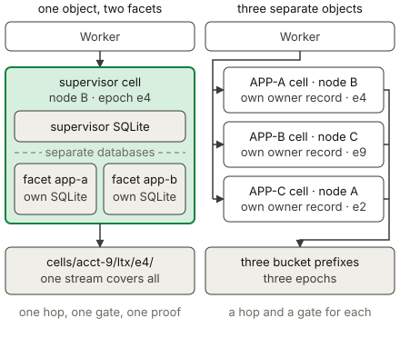

# Durable Object Facets

A facet is a child object inside a Durable Object. A supervisor class starts a
facet from a class that a [Worker Loader](dynamic-workers.md) provides, and the
supervisor and the facet then keep separate SQLite databases. An application
uses a facet to give generated or untrusted code durable storage without giving
that code a Durable Object namespace. The state of a facet lives inside the
storage of its root object, so celld replicates the two together. Read the
[Cloudflare Durable Object Facets documentation](https://developers.cloudflare.com/dynamic-workers/usage/durable-object-facets/)
for the standard API behavior.

## Example

The [facets example](../../examples/facets) creates a facet from a class that a
Worker Loader provides.

<!-- celld-example: facets -->

## A facet is a part of its root object

A facet is not a cell. celld holds the SQLite database of a facet as an image in
a row of the root cell's own database, and it copies that image into the row
before an effect of the facet leaves the node. A facet therefore owns no
ownership record, no fencing epoch, and no replication stream. It inherits all
three from the root cell, so one upload covers the writes of the supervisor and
the writes of every facet together. The
[Durable Objects page](durable-objects.md#ownership-and-the-single-threaded-model)
describes that record, that epoch, and that stream.

Containment also sets the lifecycle. A facet starts inside an event of the root
object, therefore the code of the facet runs on the node that owns the root
cell. celld releases every running facet when it releases the root cell, and the
startup callback runs again at the next call. An eviction, a reset, and a move
of ownership take the root object and its facets as one group.

celld holds an outbound effect of a facet against the output gate of the root
cell, because that effect can reveal a write that only the root cell can prove.
A root storage transaction keeps an uncommitted facet image out of the root
database, so celld rejects an outbound effect while that transaction is open.
The error states that the root transaction has not committed the facet image.
celld applies the check to a read-only call as well, because an earlier call in
the same turn can leave an image behind and the read can reveal it.

## Starting and addressing a facet

`ctx.facets.get(name, callback)` returns a stub for the facet with that name,
and celld runs the callback only when the facet is not already running. The
callback takes no argument and returns a `class` and an optional `id`. `class`
must come from `worker.getDurableObjectClass("App")` on a Worker Loader binding,
because that method is the only source of a `DurableObjectClass`. `id` sets what
the facet reads at `ctx.id`, and the facet inherits the id of its root object
when the callback gives no `id`.

The name alone selects the database, so a later call that keeps the name and
changes the `id` still reaches the stored data. A name has a limit of 256 bytes.
A facet can start a facet of its own, to a total depth of 4 that counts the root
object. `ctx.facets.abort(name, reason)` stops a running facet and keeps its
database, and a call on the stopped stub then throws the given reason.
`ctx.facets.delete(name)` stops the facet and removes its database and the
database of every facet below it. The stub answers `fetch()` and the RPC methods
of the class. The stub itself is not a promise, and a pipelined property path is
unavailable, so a call must name one method.

## Choose a facet or a second Durable Object

Use a facet when the child state belongs to the parent. The supervisor sits on
the path of every call, so it can count a call, apply a quota, and refuse a
request before the child code runs. The facet stays on the owner node of the
root cell, therefore a call from the supervisor crosses no node boundary and
waits for no second output gate. A write of the facet also becomes durable with
the next upload of the root cell, and a facet write that a root storage
transaction encloses commits with that transaction or rolls back with it. Two
separate Durable Objects give no such atomicity, because each one proves its own
writes.

A facet has a cost as well. celld copies the complete SQLite image of a facet
into the root database after a turn that changed it, so a large facet database
makes each changed turn more expensive.

Use a separate Durable Object when the children must scale apart. Each object
then takes its own id, its own ownership record, and its own owner node, so the
fleet can place two of them on two machines and the stop of one node affects one
of them. A caller can also address such an object directly with
[`idFromName()`](durable-objects.md#identity-and-addressing). No name reaches a
facet from outside its root object, and a facet that must serve external traffic
therefore needs a supervisor that forwards the request.

## Differences from Cloudflare

- Facets require Dynamic Workers and a class from a Worker Loader binding. A
  class from `ctx.exports` or a Durable Object binding is unavailable.
- Each facet has a separate SQLite database, which celld replicates with the
  root Durable Object. celld copies the complete image of that database into the
  root database after a turn that changed it, so the cost of a changed turn
  grows with the size of the facet database.
- celld rejects an outbound effect from a facet while a root storage transaction
  holds an uncommitted facet image.
- An explicit transaction keeps its uncommitted writes in the facet. A rollback
  discards those writes, and a commit makes them available for root replication.
- A facet cannot set an alarm. `storage.setAlarm()` throws inside a facet, so
  the root object must hold the schedule.
- A facet stub is not awaitable, and a pipelined property path is unavailable.
- The `clone()` method is unavailable.

The [Cloudflare compatibility](../cloudflare-compat.md#services)
page lists the runtime APIs and the unsupported services.
