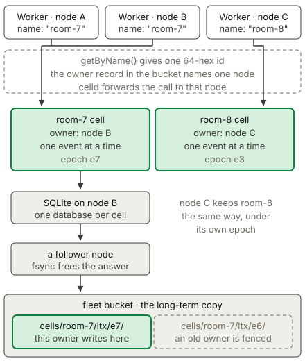

# Durable Objects / Cells

A Durable Object is a single-threaded actor with durable storage, and celld
calls each running Durable Object a cell. An application uses one when a piece
of state needs a single consistent owner, such as a chat room, a game match, a
shopping cart, an agent session, or a rate limiter. The state lives in a SQLite
database that belongs to that object alone, on the node that serves it, and
celld replicates the database to the fleet. Read the
[Cloudflare Durable Objects documentation](https://developers.cloudflare.com/durable-objects/)
for the standard API behavior.

## Example

The [counter example](../../examples/counter) keeps a counter in the key-value
storage of a Durable Object, and it uses `idFromName()` to give each name a
separate counter.

<!-- celld-example: counter -->

## Identity and addressing

A `durable_objects` binding exposes one class as a namespace, and an
application reaches an object in two steps. `env.COUNTER.idFromName("room-7")`
returns a `DurableObjectId`, and `env.COUNTER.get(id)` returns a
`DurableObjectStub`. `getByName("room-7")` performs both steps together. The
stub is only a handle, so celld creates the object at the first call and not at
`get()`. Read the
[Durable Object ID documentation](https://developers.cloudflare.com/durable-objects/api/id/)
for the complete method list.

`idFromName()` is deterministic. celld derives the id with HMAC-SHA-256 over
the name, under a key that belongs to the namespace, so one name always gives
the same 64-digit hexadecimal id. That id always reaches the same object, and
two Workers on two different nodes that use one name therefore reach one
object. The name also survives in `ctx.id.name` when it is 1024 UTF-8 bytes or
less, which is the Cloudflare rule, and a longer name still routes to the
correct object.

`newUniqueId()` instead draws random bytes, so its object carries no name and
no later caller can address it again. Keep the `toString()` form of such an id
if the application must reach the object a second time. `idFromString()` parses
that hexadecimal form and verifies the HMAC, therefore celld refuses an id that
belongs to a different namespace instead of creating an unrelated object.

celld builds the key of a namespace from the script name and the class name, so
a rename of the Worker script changes every id that the namespace derives. The
objects of the old name keep their storage under the old ids, and the renamed
script reaches new and empty objects. Keep the script name stable, or migrate
the data before the rename.

celld implements no jurisdiction, because a celld fleet has only the machines
that you run. `newUniqueId({ jurisdiction })` and `namespace.jurisdiction()`
throw an error, so an application learns about the gap at the call site.

## Ownership and the single-threaded model

Cloudflare creates an object near the first request that uses it, and
Cloudflare can migrate the object afterwards. celld makes no placement,
migration, or jurisdiction promise, and it makes one narrower promise instead:
exactly one node serves a cell at a time.

A node claims a cell by writing an ownership record into the fleet bucket with
a conditional write. The object store accepts only one of two competing
writers, so two nodes cannot own one cell. Every activation advances a fencing
epoch, and the epoch appears in the storage prefix, therefore a node that lost
the cell writes only into a superseded prefix. The
[guarantees](../guarantees.md) page gives the full mechanism.

A Worker holds its stub on whichever node served the request. celld resolves
the owner of the cell and forwards the call to that node, so the object code
runs on the owner and nowhere else. Inside the cell, one event runs at a time:
a `fetch`, an RPC method, an `alarm()`, or a WebSocket message. celld also
holds a response until a durability proof covers every write that the response
can reveal, which is the behavior Cloudflare calls the
[output gate](https://developers.cloudflare.com/durable-objects/best-practices/rules-of-durable-objects/).
An application therefore does not have to `await` a `put()`, because a client
cannot receive the response before the write survives a failure.

A cell keeps no in-memory state across an eviction. celld removes an idle cell
from memory, and the cell then hibernates on its node or becomes inactive in
the bucket, so the constructor runs again at the next event. Ownership can move
as well, because a node can stop, a node can drain, and idle rebalancing can
move a hibernated cell to another node. A reader must therefore treat only
durable storage as persistent. A hibernatable WebSocket survives a hibernation
on the same node, and it closes when the cell moves to a new owner, so a client
must reconnect. Cloudflare gives the same rule for
[in-memory state](https://developers.cloudflare.com/durable-objects/reference/in-memory-state/).

## Durable storage and alarms

`ctx.storage` gives each object its own SQLite database. A class that a
`new_sqlite_classes` migration declares can use the key-value methods `get()`,
`put()`, `delete()`, `list()`, and `deleteAll()`, and it can also run SQL
through `ctx.storage.sql.exec()`. `transaction()` and `transactionSync()` group
several writes, and `storage.sync()` waits for the durability of the earlier
committed writes. Read the
[storage documentation](https://developers.cloudflare.com/durable-objects/best-practices/access-durable-objects-storage/)
for the method signatures.

The durability of that database comes from the fleet, not from a managed
service. celld captures each write as an LTX segment and replicates the segment
to `cells/<cell>/ltx/e<epoch>/` in the fleet bucket. A fleet of two or more
nodes is faster, because the owner also sends each write to one or two follower
nodes and answers as soon as a follower holds the write on its own disk. The
bucket upload follows afterwards. A single node has no follower, so every write
on it waits for the object store instead.

`storage.setAlarm()` schedules one alarm per object, `getAlarm()` reads it, and
`deleteAlarm()` removes it. celld calls the `alarm(alarmInfo)` handler at the
scheduled time and passes `retryCount` and `isRetry`, as the
[Alarms API](https://developers.cloudflare.com/durable-objects/api/alarms/)
describes. celld does not answer a successful response until a durable wake
entry in the bucket covers the alarm, so a crash cannot lose a schedule that a
client already saw. A hibernated cell fires its alarm on the node that owns it.
One node in the fleet holds the waker role, and it wakes only a cell whose
owner node stopped, so the alarm work of the fleet does not queue on one
machine.

## Differences from Cloudflare

- celld makes no placement, migration, or jurisdiction promise. A cell runs on
  a node of your fleet, and `newUniqueId({ jurisdiction })` and
  `namespace.jurisdiction()` throw.
- The key of a namespace contains the script name, so a rename of the script
  changes every id that `idFromName()` derives.
- A `migrations` entry accepts `tag` and `new_sqlite_classes` only. A class
  rename, a class delete, and a class transfer stop the deployment.
- A Durable Object event keeps pending I/O active after the handler returns, so
  a timer or a subrequest does not require `ctx.waitUntil()`.
- The imported `waitUntil()` and `ctx.waitUntil()` can add work while previously
  registered background work remains active.
- An RPC stub cannot cross an isolate boundary. See
  [RPC](../cloudflare-compat.md#rpc).
- An outbound WebSocket does not continue after the object moves to another
  node.
- celld refuses invalid UTF-8 from a SQLite `TEXT` value. Store arbitrary bytes
  in a `BLOB`.
- `SqlStorage.Cursor.toArray()` gives a celld-specific error near the V8 heap
  limit.
- `storage.sync()` waits for the object store or the fleet ensemble to hold all
  earlier committed writes. The operation uses the shorter of the 10-second
  `CELLD_LTX_DURABILITY_TIMEOUT_SECS` default and the 15-second
  `CELLD_OPERATION_DEADLINE_MS` default.
- `storage.sync()` rejects during an open transaction and after an object abort.
  Without an object store, it resolves after the local commit.
- A transaction and `blockConcurrencyWhile()` have a 30-second limit. A timeout
  resets the object and rolls back an open transaction.
- A failed handler still waits for the durability of any value or write that it
  can expose. A celld-generated failure that exposes no object value returns
  immediately.
- Outside an explicit transaction, a SQL write cursor must finish before a
  response, an outbound effect, or `storage.sync()`. An unfinished `RETURNING`
  cursor holds uncommitted writes, so celld rejects that output with an error.
  A read cursor can remain open.

The [Cloudflare compatibility](../cloudflare-compat.md#services) page
lists the runtime APIs and the unsupported services.
