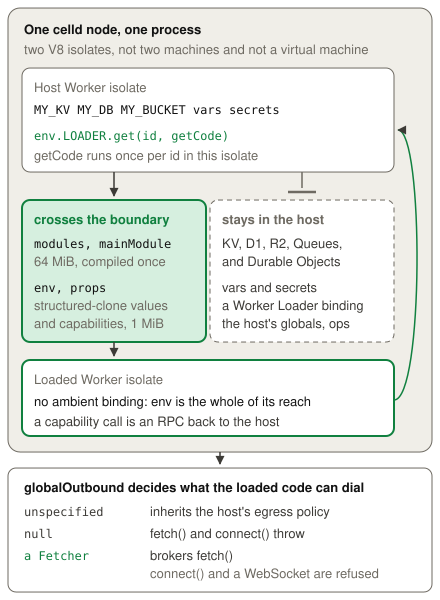

# Dynamic Workers

A Dynamic Worker is Worker code that a running Worker supplies at runtime and
loads through a Worker Loader binding. An application uses one for code that it
does not write itself: code that a customer uploads, or code that a model
writes. celld compiles that code into a separate V8 isolate on the node that
runs the loader, and it gives the loaded Worker no binding of its own, so the
loader hands over every capability that the loaded code can use, and the
durable state stays behind in the loader's own bindings. Cloudflare runs this
feature in an
[open beta](https://developers.cloudflare.com/changelog/post/2026-03-24-dynamic-workers-open-beta/),
therefore the API can still change. Read the
[Cloudflare Dynamic Workers documentation](https://developers.cloudflare.com/dynamic-workers/)
for the standard API behavior.

## Example

The [Dynamic Workers example](../../examples/dynamic-worker-tails) loads a
Worker and sends its invocation records to a Tail Worker.

<!-- celld-example: dynamic-worker-tails -->

## Loading a Worker

A `worker_loaders` entry in the Wrangler configuration adds the binding, and
the example names it `LOADER`. Wrangler accepts only the `binding` name in
this entry, so set `tails` in a `WorkerCode` object and set `limits` there or
in a `getEntrypoint()` call. celld stops the deployment when the entry
contains either option. `env.LOADER.get(id, getCode)` gives a loaded
Worker a string id, and `env.LOADER.load(code)` loads an anonymous one. celld
calls `getCode` only when it must compile, so the callback can read the code
from a store, and it can be asynchronous. A throw inside `getCode` therefore
surfaces when the application first uses the Worker, and not at the `get()`
call.

`getCode` returns a `WorkerCode` object. `mainModule` names the entry module,
and `modules` maps each module name to its source. A value in that map can also
be wasm bytes, and the [WebAssembly page](../wasm.md#dynamic-workers) shows
that form. `compatibilityDate` and `compatibilityFlags` select the runtime
behavior of the loaded Worker, and celld reads both. The module sources can
total 64 MiB, which is the workerd limit. A `WorkerCode.limits` object can
set `cpuMs` and `subRequests` for each invocation. celld refuses a
`WorkerCode` that sets `allowExperimental`. Read the
[API reference](https://developers.cloudflare.com/dynamic-workers/api-reference/)
for the complete shape.

The stub that `get()` and `load()` return invokes the loaded code.
`getEntrypoint(name, options)` gives a Fetcher for the default export or for a
named `WorkerEntrypoint`, and `getDurableObjectClass(name, options)` gives a
Durable Object class. Both accept a `props` option. `getEntrypoint()` also
accepts `limits` for its fetch and RPC calls. celld uses the lower value for
each limit when both the `WorkerCode` object and the call set it. The
`getDurableObjectClass()` options accept only `props`.

## The isolation boundary

celld compiles the loaded code into its own V8 isolate, with its own context
and its own heap. That isolate runs in the same process as the loader, on the
same node. It is not a second process and it is not a virtual machine, so the
boundary scopes what the loaded code can address, and it is not a claim about
V8 escape safety. Run the code in a container under a named runtime when the
workload needs a kernel boundary, and read
[the isolation boundary](containers.md#the-isolation-boundary) on the
Containers page.

celld builds the loaded Worker with an empty binding set. It carries no KV
namespace, no D1 database, no R2 bucket, no queue, no Workflow, no Durable
Object class, and no `vars` entry of the deployment. It also carries no Worker
Loader binding, so a loaded Worker cannot load another one. The loaded code
therefore reaches only the `env` that the `WorkerCode` supplies. That `env`
takes structured-clone values and Service Binding capabilities, and Cloudflare
gives the same
[capability rule](https://developers.cloudflare.com/dynamic-workers/usage/bindings/).
A capability call leaves the loaded isolate as an RPC into the loader's
isolate, so the loader keeps control of what the call does.

The runtime internals stay out of reach as well. celld passes each host
operation to its internal scripts as a function parameter and never as a
global, so loaded code cannot find one by reading `globalThis`. A loaded Worker
once reached the host through such a global, and the parameter form closed that
path.

`globalOutbound` decides what the loaded code can dial. celld gives the loaded
Worker the loader's own egress policy when the `WorkerCode` omits the field, so
a deployed Worker with Internet access passes that access on. A `null` value
removes every ambient connection instead, and `fetch()` and `connect()` both
throw, which leaves an `env` capability as the only way out. A Fetcher
brokers each `fetch()` through the loader, which can read the request, change
it, or refuse it. celld does not broker a `connect()` or a WebSocket through a
Fetcher, and each of those throws, because celld's service protocol carries no
bidirectional tunnel and a direct socket would pass the broker in silence. Read
the
[egress control documentation](https://developers.cloudflare.com/dynamic-workers/usage/egress-control/)
for the Cloudflare behavior.

## Lifetime and caching

`get(id, getCode)` memoizes the load by id inside one loader binding of one
host isolate. The first use of an id runs `getCode` and compiles the modules,
and a later use of that id in the same isolate reuses the compiled isolate and
runs no callback, so module scope survives between the two calls. Another
isolate holds its own map. A request that a different node serves, or a fresh
isolate on the same node, therefore pays the compile again. Two `worker_loaders`
entries are two maps as well, so the same id in each one loads twice.
Cloudflare describes the same reuse as a possibility and not as a guarantee.

`load(code)` caches nothing and compiles on each call. Its isolate goes away
when the application disposes the stub, and a garbage collection of an
undisposed stub drops it as a backstop. A `get()` stub instead stays in the
memo map, so its loaded isolate lives as long as the loader's isolate does.

Every loaded Worker belongs to the isolate that created it. celld drops all of
them when that isolate retires, which happens when the request load falls or
when a new deployment supersedes the script. An in-flight call finishes first.
A loaded Worker therefore never outlives its loader, and a redeploy compiles
the code again.

A process holds at most 256 live Dynamic Workers, and one generation of one
script holds at most 255 of them. The last slot stays reserved, so a single
runaway loader cannot take the whole process. A load over either limit throws.

## Differences from Cloudflare

- The process limit is 256 live Dynamic Workers, and each script generation can
  use 255 slots. Every loader and script shares the process limit.
- The process rejects the removed `CELLD_MAX_LOADED_WORKERS` environment
  variable.
- `getEntrypoint()` supports `props` and `limits` options, while
  `getDurableObjectClass()` supports only `props`. A structured-clone encoded
  `props` value can be at most 1 MiB.
- A `globalOutbound` Fetcher cannot use `connect()` or a WebSocket.
- A `WorkerCode.tails` array accepts Service Binding Fetchers. Each Fetcher
  receives one event after a Dynamic Worker fetch invocation finishes.
- The event contains the request metadata, the response status, the console
  logs, the uncaught exception, and the invocation outcome.
- celld records at most 256 KiB of serialized console log records for each
  invocation. It stops recording when the next complete record exceeds this
  limit.
- Tail delivery starts after the response is available. A Tail Worker failure
  does not change the response, and celld writes the failure to the console.
- celld enforces `cpuMs` and `subRequests` in `WorkerCode.limits` and in a
  `getEntrypoint()` call. It rejects `allowExperimental`.
- `WorkerCode.env` accepts structured-clone values and Service Binding
  capabilities. The encoded values and the capability props can total 1 MiB.
- A loaded Worker entrypoint cannot transfer to another Worker. Awaitable and
  pipelined properties are also unavailable.

The [Cloudflare compatibility](../cloudflare-compat.md#services) page
lists the runtime APIs and the unsupported services.
