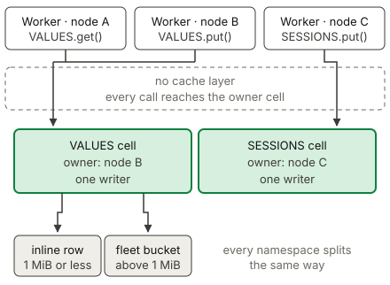

# KV

KV is a key-value store that an application accesses through a binding. A
Worker reads a value with `env.NAMESPACE.get()`, and it writes one with
`env.NAMESPACE.put()`. An application uses KV for data that many requests read
and few requests change, such as a feature flag, a redirect table, or a
configuration document. Each namespace lives in one celld cell, and a value
above 1 MiB lives in the fleet bucket. Read the
[Cloudflare KV documentation](https://developers.cloudflare.com/kv/api/) for the
standard API behavior.

## Example

The [KV example](../../examples/kv) reads, writes, and deletes values in a KV
namespace.

<!-- celld-example: kv -->

## Namespaces, keys, and values

A project declares a namespace with a `kv_namespaces` entry that gives a
`binding` name and an `id`. celld uses the `id` as the namespace identity,
whatever string it holds, so a hexadecimal id from Cloudflare and a plain name
such as `sessions` both work. A namespace belongs to the fleet and not to one
script, so two Workers that name one `id` reach one namespace. celld accepts
`preview_id` and ignores it, because celld does not run `wrangler dev`.

`put()` accepts a string, an `ArrayBuffer`, a typed array, or a
`ReadableStream`, and celld copies the bytes at the call so a later change to
the buffer cannot alter the stored value. celld reads a stream to its end
before the write, therefore `put(key, request.body)` stores a request body.
`get()` returns the value as `"text"`, `"json"`, `"arrayBuffer"`, or
`"stream"`. `getWithMetadata()` also returns the metadata that the write
attached, and a missing key gives `null` in both methods. `list()` returns at
most 1000 key names in byte order, and its cursor resumes after the last
returned name, so a concurrent write cannot make the pagination skip a key.

celld enforces the
[Cloudflare KV limits](https://developers.cloudflare.com/kv/platform/limits/): a
key of at most 512 bytes, a value of at most 25 MiB, and serialized metadata of
at most 1024 bytes. One bulk `get()` takes at most 100 keys. celld refuses a
call that crosses a limit instead of truncating the data, so the application
learns about the problem at the call site.

A write can set `expiration` as an absolute time in seconds, or `expirationTtl`
as a count of seconds from now. The minimum lifetime is 60 seconds. celld
filters an expired key on the read path, so the key becomes invisible at the
moment it expires, and a sweeper reclaims the storage afterwards.

## The read and write path

A Cloudflare namespace is
[a database that replicates to the global network](https://developers.cloudflare.com/kv/concepts/kv-namespaces/),
and each location caches the values that it reads. celld has no such cache. A
celld namespace is one cell, which is the same single-threaded actor that runs a
Durable Object, so the namespace state lives in that cell's SQLite database.
Every call reaches the node that owns the cell, therefore a celld read returns
the committed value and is never stale.

One cell owns a namespace, and a cell has one writer. Two writes to one
namespace therefore run one after the other, even when they touch different
keys. More nodes do not divide that work, because the namespace has one owner.
An application that needs more write capacity splits its keys across more
namespaces, because KV has no operation that spans two keys.

Reads and writes cost different amounts. A write commits to the cell's SQLite
database and replicates to the fleet, so it pays for durability every time. A
read only answers from the committed state. This asymmetry makes KV a good
choice for configuration data that a Worker reads on every request, and a poor
choice for a counter that many requests increment. Use a Durable Object for a
write-hot value, which is the same advice that
[Cloudflare gives](https://developers.cloudflare.com/kv/concepts/how-kv-works/).

A read also has a cost in celld that it does not have on Cloudflare. Cloudflare
answers a hot key from a cache in the location that serves the request. celld
sends every `get()` to the owner node, so a read costs one cell dispatch. An
application that reads one key many times inside one request must hold the value
in a local variable.

## A value above the inline limit

celld keeps a value of 1 MiB or less inside the cell, because such a value
replicates with the cell's other writes. A larger value goes to the fleet bucket
under a content address, and the cell row holds only the reference. This split
keeps one large `put()` from becoming the most expensive operation in the
runtime. Cloudflare made the same split for the same reason, and sends a large
value to object storage.

A node therefore needs a fleet bucket to write a value above 1 MiB. Without one,
the write fails with the message `KV large values need a fleet bucket`. celld
writes the object before it commits the row, so a crash between the two steps
leaves an unreferenced object that a collector removes later. A committed row
never names an object that does not exist.

## Differences from Cloudflare

- A celld read never returns a stale value, because it reaches the cell that
  owns the namespace. Cloudflare KV is eventually consistent.
- celld has no edge cache. `cacheTtl` has no effect, and `cacheStatus` is
  `null`.
- A value above 1 MiB requires a fleet bucket.
- A namespace has one writer. Use more namespaces to increase write capacity.

The [Cloudflare compatibility](../cloudflare-compat.md#services) page lists the
runtime APIs and the unsupported services.
