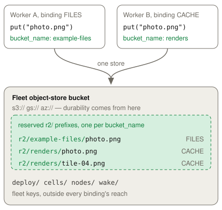

# R2

[R2](https://developers.cloudflare.com/r2/) is object storage. A bucket holds
unstructured blobs of any size, and an application reads or writes a blob by
name. An application uses R2 for a file that a request handler must keep: an
upload, an image, a backup, a build artifact, or a large data export. A Worker
reaches a bucket through an `r2_buckets` binding, so `env.BUCKET` gives the
bucket API without a credential in the Worker code. The objects live outside the
Worker isolate, in the fleet object store that the node already uses. Read the
[Workers API reference](https://developers.cloudflare.com/r2/api/workers/workers-api-reference/)
for the full method list.

## Example

The [R2 example](../../examples/r2) reads, writes, and deletes objects in an R2
bucket.

<!-- celld-example: r2 -->

## The object model

A bucket contains objects, and each object has a key. A key is a string of 1 to
1024 bytes. The namespace is flat, so a slash in a key is only a character, and
`list()` folds a prefix into a group when a caller passes a `delimiter`. See
[Objects](https://developers.cloudflare.com/r2/objects/) for the upstream model.

An object carries a body and a record. The record holds `httpMetadata` (the
content headers and a cache expiry), `customMetadata` (the application's own
string map), `checksums`, a `storageClass`, a `size`, an `uploaded` time, an
`etag`, and a `version`. celld stores the body as a plain object in the fleet
bucket and writes the five content headers as real headers, so another tool can
read the object. The parts that an object store has no place for travel as one
JSON value in a reserved metadata entry, and an object without that entry still
reads correctly.

celld takes the `version` from the object store. Most object stores report no
version identifier, so the ETag becomes the version. Two writes of identical
bytes therefore produce the same version, and an application must not use a
version to count writes.

## Where celld stores an object

celld does not run its own blob service, because celld already runs on one. An
R2 binding therefore uses the fleet bucket that the node opened with `--bucket`,
and it does not use a second store or a second credential. The durability of an
R2 binding is the durability of that object store, and it is not the durability
of Cloudflare R2. A node that starts without a fleet bucket has nowhere to put a
blob, so every R2 method on such a node fails with an explicit error.

Each binding is a logical bucket with its own `bucket_name`, and celld gives
each one a reserved key space in the single fleet bucket. A call to `get()`,
`put()`, `head()`, or `delete()` turns the key into `r2/<bucket_name>/<key>`
before the call reaches the store. The `bucket_name` comes from the deployment
manifest, which validates it, so two bindings cannot collide and no binding can
read or overwrite the fleet's own keys.

`get(key)` returns an `R2ObjectBody`, or `null` when the key is absent. The body
arrives as a `ReadableStream` from the host, so a large object never has to fit
in the isolate heap. `get()` also accepts a range, and celld accepts every range
spelling that R2 accepts: an `offset`, a `length`, a `suffix`, or a `Range`
header. `put(key, value, options)` accepts a string, an `ArrayBuffer`, a typed
array, a `Blob`, or a `ReadableStream`. celld writes a small body in one
request, and a streamed body that grows past 8 MiB becomes a multipart upload to
the object store. `delete(keys)` removes up to 1000 keys in one call, and
`head(key)` returns the record without the body.

celld serves a bucket through the binding only. There is no public bucket URL,
no presigned URL, and no S3 endpoint into an R2 binding, so an application must
put a Worker in front of the bytes it wants to publish.

## Conditional requests and multipart uploads

A conditional operation takes an `onlyIf`, either as an `R2Conditional` or as a
`Headers` object with `If-Match`, `If-None-Match`, `If-Modified-Since`, or
`If-Unmodified-Since`. A refused `get()` answers the record with no body, and a
refused `put()` answers `null`. celld passes the precondition to the object
store, which applies it. A streamed body larger than 8 MiB becomes a multipart
upload, and a multipart completion takes no precondition, so celld refuses a
conditional write of such a body instead of dropping the condition.

`createMultipartUpload(key)` returns a handle, `uploadPart(number, value)` sends
one part, and `complete(parts)` assembles the object. Read
[Multipart upload](https://developers.cloudflare.com/r2/objects/multipart-objects/)
for the part-size and part-number rules. celld holds the upload in the node that
opened it, because the handle that the object store returns cannot be derived
again from an upload id. An upload therefore cannot resume on another node or
after a restart.

celld hands the parts to the object store in ascending order, because the store
appends them. A part that arrives before its predecessor waits in memory, and
that backlog can reach 256 MiB before celld refuses a further part. A part that
is still waiting can be replaced by a second upload of the same number. A part
that already went to the store cannot be replaced, so celld refuses that write
rather than losing the bytes without a report.

## Differences from Cloudflare

- An R2 binding uses the fleet bucket under `r2/<bucket_name>/`.
- The five content headers are stored as headers. `customMetadata`,
  `cacheExpiry`, the checksums, and the storage class are stored together as
  one JSON value, under the `celld-r2` user-metadata name (`celld_r2` on
  Azure Blob Storage, which refuses a hyphen in a metadata name).
- An object another tool wrote still reads through the binding. Its user
  metadata becomes its `customMetadata`, and its headers become its
  `httpMetadata`. Use `celld r2 put` to write the complete record.
- `celld r2 get|head|put|delete|list` replaces `wrangler r2 object`. The
  command reads the fleet bucket directly, so it needs no running node.
- An object `version` equals its content ETag, so identical content produces
  the same version.
- `ssecKey` and `jurisdiction` are unavailable.
- A conditional write cannot use a streamed body larger than 8 MiB.
- `createMultipartUpload()` does not accept a checksum.
- A multipart upload cannot resume on another node or after a restart. celld
  also cannot replace a part that the object store already holds.
- Out-of-order parts can use at most 256 MiB of memory, and completion cannot
  change the stored part order.

The [Cloudflare compatibility](../cloudflare-compat.md#services) page lists the
runtime APIs and the unsupported services.
