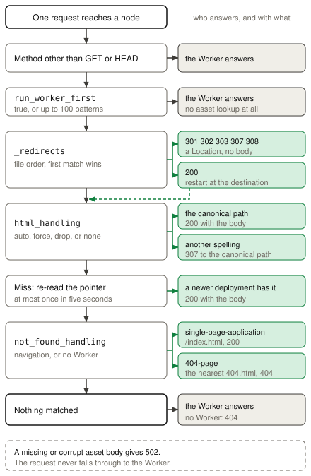

# Static assets

Static assets serve the files of a directory, with a Worker or without one. An
application uses them for the front end that a browser downloads: an HTML page,
a stylesheet, a script bundle, a font, or an image. `celld deploy` uploads the
directory with the deployment, so the files become part of the deployed version
and not a separate store. The bytes live in the fleet bucket, and a node copies
a file to its own disk cache when it first serves that file. Read the
[Cloudflare Static Assets documentation](https://developers.cloudflare.com/workers/static-assets/)
for the standard behavior.

## Example

The [Static assets example](../../examples/static-assets) serves an HTML file
from the `public` directory without a Worker. A `_headers` file adds a response
header, and a `_redirects` file moves `/home` to `/`.

<!-- celld-example: static-assets -->

## What a deployment uploads

An `assets` block in the Wrangler configuration names the directory. celld
accepts five keys in that block: `directory`, `binding`, `html_handling`,
`not_found_handling`, and `run_worker_first`. It refuses any other key by name,
so an unsupported Cloudflare option stops the deployment instead of changing the
behavior in silence. A project that declares `assets` and no `main` is an
asset-only project, and such a project cannot set `run_worker_first` or declare
a binding, because it runs no code. The
[binding documentation](https://developers.cloudflare.com/workers/static-assets/binding/)
describes the same keys for Cloudflare.

`celld deploy` reads each file, takes the SHA-256 digest of the exact bytes, and
stores the body once under that digest. Two identical files in one directory
therefore upload one body. A redeploy compares the digest with the stored object
and skips a body that the fleet already holds, so a build that changes one file
uploads one file. The command also assigns a content type from a fixed table of
file extensions. An unknown extension gets no `Content-Type` header at all,
which is the behavior that Wrangler produces.

The upload produces an index beside the deployment manifest. The index maps each
path to its digest, its size, and its content type, and it carries the `assets`
configuration and the complete text of the `_headers` and `_redirects` files.
The manifest names the index and the checksum of the index. celld writes the
bodies first, then the index, then the manifest, and the deployment pointer
last. A node therefore cannot read a pointer whose bodies are still incomplete.
A node loads only the index at startup and fetches a body when a request asks
for it, so a large asset directory does not become a large startup cost.

## The routing decision

A request meets the asset layer before it meets the Worker. celld considers only
a `GET` or a `HEAD` request for an asset, and it sends every other method to the
Worker. `run_worker_first` reverses the order. It takes `true`, or a list of up
to 100 route patterns in which a `!` prefix excludes a path, and a match sends
the request to the Worker with no asset lookup. Cloudflare describes the same
control in its
[Worker script routing documentation](https://developers.cloudflare.com/workers/static-assets/routing/worker-script/).

The `_redirects` rules run before any file lookup, in file order, and the first
match wins. A rule with status 301, 302, 303, 307, or 308 answers with a
`Location` header. A rule with status 200 names a local path, and routing
restarts at that path, so the client sees the destination content under the
original URL.

`html_handling` then decides which file a path can reach.
`auto-trailing-slash` is the default, and it maps `/about` to `/about.html` and
`/about/` to `/about/index.html`. `force-trailing-slash` and
`drop-trailing-slash` pick one spelling, and `none` matches the exact path only.
When the request uses a spelling that is not the canonical one, celld answers
`307` to the canonical path and keeps the query string. The
[html_handling documentation](https://developers.cloudflare.com/workers/static-assets/routing/advanced/html-handling/)
lists the same four modes.

A miss has one more step that Cloudflare does not need. celld re-reads the
deployment pointer, at most once in five seconds, because a rolling restart can
leave one node on an older index while an upgraded node serves HTML that names a
newer content-hashed file. A newer index therefore answers the request instead
of a broken page.

`not_found_handling` fabricates the last answer. `single-page-application`
returns `/index.html` with status 200, and `404-page` returns the nearest
`404.html` with status 404, which
[Cloudflare also does](https://developers.cloudflare.com/workers/static-assets/routing/single-page-application/).
celld applies this step only when the deployment has no Worker, or when the
request is a navigation request. A deployment with a Worker therefore keeps a
non-navigation miss for the Worker, and the Worker answers it. When nothing
matches and there is no Worker, the node answers `404`.

One failure never reaches the Worker. A body that the fleet bucket cannot supply
gives `502`, because a silent fall through would run the Worker for a request
that an asset owns.

## How a node serves a file

A node fetches a body once and writes it to a local disk cache. It verifies the
digest after the write, and it keeps the cache under a bound of 512 MiB that
`CELLD_ASSET_CACHE_BYTES` changes. The cache evicts the least recently used file
when it crosses the bound, so the cache is a copy and never the durable record.
The fleet bucket holds the durable bytes.

The `ETag` is the strong SHA-256 digest of the body. A conditional `GET` with
`If-None-Match` therefore gives `304` with no body, and a changed file gives a
new tag. celld sends no `Last-Modified` header and reads no `If-Modified-Since`
header, so revalidation uses the tag. A `Range` header selects one byte range
and gives `206`, an unsatisfiable range gives `416`, and a `HEAD` request keeps
the real `Content-Length` with an empty body. celld also sends
`Cache-Control: public, max-age=0, must-revalidate` on a plain request, which
makes a browser revalidate each time.

celld runs no edge cache and no content delivery network, so this response path
is the whole of it. Cloudflare caches an asset in the location that serves the
request and pulls a miss from a nearby cache. A celld fleet has only the
machines that you run. Latency comes from your own placement, and a `_headers`
rule that sets a long `Cache-Control` on a content-hashed file is the way to
keep a browser from asking again.

A `binding` name puts the same serving code behind `env.ASSETS.fetch()`. The
binding takes a `Request`, a `URL`, or a string, and `fetch()` is its only
method. It answers `405` for a method other than `GET` or `HEAD`, and it always
applies `not_found_handling`, so a Worker can render a fallback page itself.

## Differences from Cloudflare

- celld does not compress an asset response. Use a compressing ingress proxy
  when a client needs gzip or brotli.
- celld has no edge cache. Each node keeps a 512 MiB disk cache, configured by
  `CELLD_ASSET_CACHE_BYTES`, and requires browser revalidation.
- A node checks the deployment pointer after an asset miss at most once in five
  seconds.
- celld reads `If-None-Match` and `If-Range`. It sends no `Last-Modified` header
  and reads no `If-Modified-Since` header.
- A `_headers` file cannot change `connection`, `content-length`, or
  `transfer-encoding`.
- A deployment can contain 20,000 assets, 25 MiB for each asset, and 1 GiB in
  total. Each `_headers` or `_redirects` file has a 100 KiB limit.
- `celld deploy` accepts only `directory`, `binding`, `html_handling`,
  `not_found_handling`, and `run_worker_first` in the `assets` block.
- `celld deploy` refuses a `.assetsignore` file, and it stops the deployment
  instead of ignoring the file. It also refuses a symbolic link, a special
  file, a non-UTF-8 name, an unsafe decoded path, and a `_worker.js` entry.
- The assets binding has one method, `fetch()`. celld supplies no `unstable_`
  helper.

The [Cloudflare compatibility](../cloudflare-compat.md#services) page
lists the runtime APIs and the unsupported services.
