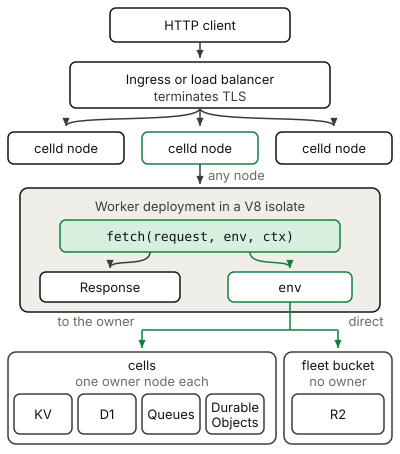

# Workers

A Worker is a stateless request handler that uses the Cloudflare Workers API.
An application uses a Worker for the code that answers an HTTP request, such as
an API endpoint, a router, a webhook receiver, or a front end for a binding.
celld runs the deployment in a V8 isolate on a node of the fleet, so a Worker
keeps the persistent state of an application in a binding instead. Read the
[Cloudflare Workers documentation](https://developers.cloudflare.com/workers/runtime-apis/)
for the standard API behavior.

## Example

The [hello example](../../examples/hello) returns a text response from a
`fetch` handler.

<!-- celld-example: hello -->

## The request path

An operator puts an ingress proxy or a load balancer in front of the fleet.
The ingress terminates TLS, because celld serves plain HTTP on the public
listener of a node. The load balancer can send a request to any node in its
rotation, and every node embeds V8 and holds the current deployment. The node
that accepts the request therefore runs the handler itself, and it forwards
only a binding call that a different node owns.

Cloudflare instead routes a request through its own global network and starts
the Worker in a nearby data center. A celld fleet has only the machines that
you run, so you control the placement and the routing. Read
[How Workers works](https://developers.cloudflare.com/workers/reference/how-workers-works/)
for the Cloudflare model.

## The handler

An HTTP request invokes the `fetch(request, env, ctx)` handler that the module
exports as its default export. The handler receives the inbound `Request`, and
it must return a `Response`. A module can export more handlers, such as
`scheduled` for a Cron Trigger or `queue` for a Queues consumer. Read the
[handlers documentation](https://developers.cloudflare.com/workers/runtime-apis/handlers/)
for the complete list, and the
[fetch handler documentation](https://developers.cloudflare.com/workers/runtime-apis/handlers/fetch/)
for the parameters.

The `ctx` argument controls the lifetime of the invocation. `ctx.waitUntil()`
keeps the isolate alive for a promise after the response goes to the client.
`ctx.passThroughOnException()` has no effect on celld, because celld has no CDN
that can answer in place of a failed Worker.

## State and bindings

The `env` argument contains the bindings that the Wrangler configuration
declares. A binding gives the Worker a permission and an API together, so the
code needs no credential for the target service. Read the
[bindings documentation](https://developers.cloudflare.com/workers/runtime-apis/bindings/)
for the configuration syntax.

A binding call leaves the isolate, and the target decides where the call goes.
A KV namespace, a D1 database, a queue, and a Durable Object are each a cell,
and one node owns a cell at a time, so celld routes the call to that owner. An
R2 binding has no cell, and it reads and writes the fleet bucket directly.

celld runs many requests in one isolate, so a value in the module scope can
still be present for a later request. That value is not a safe place for
application state. The load balancer can send the next request to a different
node, and celld retires an isolate when the request load falls or when a new
deployment supersedes it, so the value can also disappear. A Worker must
therefore not depend on mutable in-memory state, and it must write the state
that it must keep into a binding. The Cloudflare
[best practices](https://developers.cloudflare.com/workers/best-practices/workers-best-practices/)
give the same rule.

## Differences from Cloudflare

- celld does not manage a custom domain or terminate TLS. Terminate TLS in the
  ingress proxy.
- celld does not supply a Workers AI binding. Call an AI provider from the
  application. The process rejects `CELLD_AI_BINDING` and `CELLD_AI_URL`, and a
  deployment rejects an `ai` declaration.

The [Cloudflare compatibility](../cloudflare-compat.md#services) page lists the
runtime APIs and the unsupported services.
