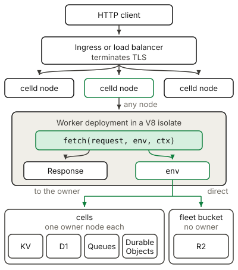

# Workers

A Worker is a stateless request handler that uses the Cloudflare Workers API.
An application uses a Worker for the code that answers an HTTP request, such as
an API endpoint, a router, a webhook receiver, or a front end for a binding.
celld runs the deployment in a V8 isolate on a node of the fleet, so a Worker
keeps the persistent state of an application in a binding instead. Read the
[Cloudflare Workers documentation](https://developers.cloudflare.com/workers/runtime-apis/)
for the standard API behavior.

## Example

The [hello example](../../examples/hello) returns a text response from a
`fetch` handler.

<!-- celld-example: hello -->

## The request path

An operator puts an ingress proxy or a load balancer in front of the fleet.
The ingress terminates TLS, because celld serves plain HTTP on the public
listener of a node. The load balancer can send a request to any node in its
rotation, and every node embeds V8 and holds the current deployment. The node
that accepts the request therefore runs the handler itself, and it forwards
only a binding call that a different node owns.

Cloudflare instead routes a request through its own global network and starts
the Worker in a nearby data center. A celld fleet has only the machines that
you run, so you control the placement and the routing. Read
[How Workers works](https://developers.cloudflare.com/workers/reference/how-workers-works/)
for the Cloudflare model.

## The handler

An HTTP request invokes the `fetch(request, env, ctx)` handler that the module
exports as its default export. The handler receives the inbound `Request`, and
it must return a `Response`. A module can export more handlers, such as
`scheduled` for a Cron Trigger or `queue` for a Queues consumer. Each export of
the main module must be a handler object or a class, as in workerd. A Worker
whose main module exports a string or a number therefore fails to start. Read
the
[handlers documentation](https://developers.cloudflare.com/workers/runtime-apis/handlers/)
for the complete list, and the
[fetch handler documentation](https://developers.cloudflare.com/workers/runtime-apis/handlers/fetch/)
for the parameters.

The `ctx` argument controls the lifetime of the invocation. `ctx.waitUntil()`
keeps the isolate alive for a promise after the response goes to the client.
`ctx.passThroughOnException()` has no effect on celld, because celld has no CDN
that can answer in place of a failed Worker.

## State and bindings

The `env` argument contains the bindings that the Wrangler configuration
declares. A binding gives the Worker a permission and an API together, so the
code needs no credential for the target service. Read the
[bindings documentation](https://developers.cloudflare.com/workers/runtime-apis/bindings/)
for the configuration syntax.

A binding call leaves the isolate, and the target decides where the call goes.
A KV namespace, a D1 database, a queue, and a Durable Object are each a cell,
and one node owns a cell at a time, so celld routes the call to that owner. An
R2 binding has no cell, and it reads and writes the fleet bucket directly.

celld runs many requests in one isolate, so a value in the module scope can
still be present for a later request. That value is not a safe place for
application state. The load balancer can send the next request to a different
node, and celld retires an isolate when the request load falls or when a new
deployment supersedes it, so the value can also disappear. A Worker must
therefore not depend on mutable in-memory state, and it must write the state
that it must keep into a binding. The Cloudflare
[best practices](https://developers.cloudflare.com/workers/best-practices/workers-best-practices/)
give the same rule.

## Differences from Cloudflare

- celld does not manage a custom domain or terminate TLS. Terminate TLS in the
  ingress proxy.
- celld does not supply a Workers AI binding. Call an AI provider from the
  application. The process rejects `CELLD_AI_BINDING` and `CELLD_AI_URL`, and a
  deployment rejects an `ai` declaration.

The [Cloudflare compatibility](../cloudflare-compat.md#services) page lists the
runtime APIs and the unsupported services.

## Python Workers

A Worker whose `main` is a `.py` file runs on celld with the
[Cloudflare Python Workers](https://developers.cloudflare.com/workers/languages/python/)
API: a `Default` class that extends `WorkerEntrypoint`, the `Response`
and `fetch` of the `workers` package, and bindings on `self.env`. The same
project runs on Cloudflare without a change.

The [Python example](../../examples/python) uses the SDK and a vendored
package to handle a request.

<!-- celld-example: python -->

celld supports a bounded part of the Python Workers platform. This page
lists what that part is.

### Build a project

Run `uv run pywrangler sync` to vendor the project's packages with
Cloudflare's `pywrangler`. Then run `celld dev .` to start the project.

`pywrangler sync` writes the packages to `python_modules/`, including the
Workers SDK (`workers-runtime-sdk`). The build rejects an incomplete Workers
SDK. `celld deploy` embeds the files below the directory of `main` that
Wrangler uploads with its default module rules: `.py`, `.txt`, `.html`,
`.sql`, `.bin`, and `.wasm` files. It also embeds the files of
`python_modules/`, and puts all of them in one bundle with the Pyodide
runtime. The Worker can open each embedded file under `/session/metadata`,
as on Cloudflare. Nothing is downloaded when the Worker runs.

The first build downloads the Pyodide runtime files from the Pyodide CDN
and checks the size and the SHA-256 of each one. Later builds reuse them
from `$XDG_CACHE_HOME/celld/pyodide-0.28.3`, or from
`~/.cache/celld/pyodide-0.28.3` when `XDG_CACHE_HOME` is not set. Set
`CELLD_PYTHON_RUNTIME_DIR` to use another directory; a directory that
already holds the files lets a build run offline. A download fails when the
CDN sends no data for 60 seconds, so a stalled network does not stop the
build without an error. The build needs `esbuild` on `PATH`, as a JavaScript build
does, or `CELLD_ESBUILD` set to its path.

A Python deployment requires the `python-workers-v1` feature.
`celld deploy` does not examine the nodes of the fleet, so the
deployment succeeds even when a node does not have the feature. A running node that
predates the feature logs an error and continues to serve its current
deployment, so the fleet then serves two versions. A node that predates
the feature and starts while a Python deployment is current exits with
an error. Therefore, upgrade every node before the first Python
deployment, and do not replace this celld version with an earlier one
while a Python deployment is current.

### Runtime version

celld runs Pyodide 0.28.3 with CPython 3.13.2 and the `pyodide_2025_0`
wheel ABI. This is the runtime line that Cloudflare selects with
`python_workers_20250116` (Cloudflare runs Pyodide 0.28.2 with its own
patches). The configuration must select that line and the vendored SDK:

- `compatibility_flags` includes `python_workers`.
- `compatibility_date` has the form `YYYY-MM-DD`.
- `compatibility_date` is 2026-04-21 or later, which turns on
  `enable_python_external_sdk`, `python_no_global_handlers`, and the
  `python_modules` search path. With an earlier date, a flag must turn on
  each behavior that the date does not turn on:
  `python_workers_force_new_vendor_path` before 2025-08-11,
  `python_no_global_handlers` before 2025-08-14, `python_workers_20250116`
  before 2025-09-29, and `enable_python_external_sdk` before 2026-04-21.
- `compatibility_date` is before 2026-09-08, or the flags include
  `no_python_workers_314`. From 2026-09-08 Cloudflare runs Pyodide 314
  (Python 3.14), which needs wheels for another ABI.

celld refuses other settings at deploy time. `python_process_pth_files`
follows its compatibility date (2026-05-26).

### Supported

| API | Notes |
| --- | --- |
| `Default(WorkerEntrypoint).fetch` | One instance for each request, as on Cloudflare |
| `workers.Response`, `Response.json`, request body, text and headers | Compared with workerd in the tests |
| `workers.fetch` | Outbound HTTP |
| `self.env` bindings | Tested with KV. Other bindings are the objects a JavaScript Worker gets, untested from Python |
| `self.ctx.waitUntil` | Python awaitables are kept alive until they settle |
| Pure-Python packages in `python_modules/` | Tested with `beautifulsoup4` |
| `from js import ...` | The JavaScript globals of the isolate |

### Not supported

- Durable Objects, Workflows, Cron Triggers and Queue consumers written
  in Python. `celld deploy` refuses a Python project that declares them.
- Named entrypoint classes and RPC to Python methods.
- Packages with compiled extensions (`.so` files), and the standard
  library modules that Pyodide ships as separate packages: `ssl`,
  `sqlite3`, `lzma`, and the OpenSSL-backed `hashlib` algorithms.
- `pyodide.ffi.run_sync`, and `workers.import_from_javascript` for
  modules other than `cloudflare:workers` and `cloudflare:sockets`. celld
  hides WebAssembly stack switching (JSPI) from the runtime, because under
  JSPI each async entry leaks C stack until the interpreter stops.
- `process.exit()` throws an error in a Python Worker.
- Memory snapshots and the import patches of the `_cloudflare` package.
  Package patches that need them, such as synchronous FastAPI handlers,
  do not apply.

### Failure behavior

The interpreter starts on the first request that an isolate handles, and
concurrent first requests share that start. If the main module raises an
error, every request to that isolate fails with the same traceback.

A fatal interpreter error, such as a C stack overflow from deep
recursion, fails the request in flight and the other requests that the
isolate is running. celld then replaces the isolate, as Cloudflare does.
The next request goes to another isolate, so it can wait for a new
interpreter to start.
