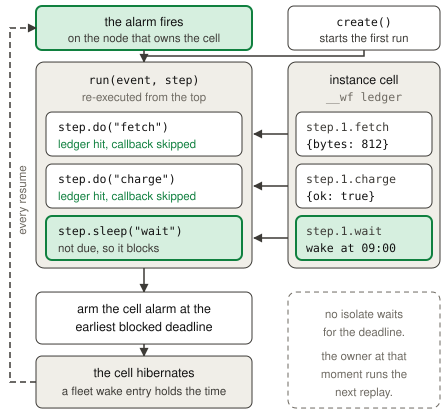

# Workflows

A Workflow is a durable function that runs as a named sequence of steps,
sleeps, and events. An application uses a Workflow for work that must survive a
failure or a long delay, such as an order pipeline, a staged import, or an
export that retries. celld runs each instance as a cell, so the state of an
instance lives in that cell's storage and moves with the cell. Read the
[Cloudflare Workflows documentation](https://developers.cloudflare.com/workflows/build/workers-api/)
for the standard API behavior.

## Example

The [Workflow example](../../examples/workflow) fetches a document and stores
the result of a durable step.

<!-- celld-example: workflow -->

## Steps and replay

A Workflow class extends `WorkflowEntrypoint` and implements
`run(event, step)`. `event.payload` holds the parameters that `create()`
supplied, and the `step` object supplies the durable operations. A value that
`run()` returns becomes the `output` field of `status()`. Read the
[Workers API documentation](https://developers.cloudflare.com/workflows/build/workers-api/)
for the complete signature.

celld does not stop `run()` in place and continue it later. Each time an
instance makes progress, celld calls `run()` again from the first line. A step
that already finished returns its stored result, and its callback does not run
a second time. celld writes each result into the storage of the instance cell,
under a key that joins the step name and the occurrence count of that name, so
a step inside a loop keeps one record for each iteration.

This design puts one rule on the application code: everything outside a step
callback runs again on every replay. Put each subrequest, each side effect, and
each value that must stay stable inside a `step.do()` callback. Cloudflare
gives the same rule in the
[rules of Workflows](https://developers.cloudflare.com/workflows/build/rules-of-workflows/).

celld ends an invocation when no step callback runs and no step can make
progress. `run()` can also await work that is not a step. Upstream permits that
await and does not make it durable, and celld accepts it for a short time. A
replay cannot resume such an await, therefore celld fails the instance when it
keeps `run()` pending for 60 seconds while no step runs and none waits.

## Sleeping and waiting for an event

`step.sleep(name, duration)` and `step.sleepUntil(name, timestamp)` stop the
instance until a deadline. `step.waitForEvent(name, options)` stops it until
`sendEvent()` delivers an event of the matching type, or until a timeout that
is 24 hours by default. Read
[sleeping and retrying](https://developers.cloudflare.com/workflows/build/sleeping-and-retrying/)
and
[events and parameters](https://developers.cloudflare.com/workflows/build/events-and-parameters/)
for the durations and the event rules.

celld computes the deadline once and commits it with the step record. A later
replay reads the stored deadline instead of adding the duration to the current
time, therefore a crash or a slow resume cannot move the wake further away.

A waiting instance holds no isolate. celld arms the alarm of the instance cell
at the earliest blocked deadline and returns, so the cell hibernates like any
other [cell](durable-objects.md) when the alarm is further away than the
near-alarm residency window. That window is one hour, and
`CELLD_ALARM_RESIDENT_MS` changes it. The armed alarm has a durable wake entry
in the fleet, and the node that owns the cell at the deadline runs the next
replay.

An event that arrives before the instance reaches its wait step is buffered,
and a matching step then consumes the buffered events in arrival order. celld
deletes the event and writes the step record in one SQLite commit, so an
acknowledged event cannot disappear. celld compares the stored deadline before
the buffer, therefore a late replay cannot accept an event that arrived after
the step timed out.

## Retries, failure, and a node that stops

`step.do()` retries a failed callback. celld uses the upstream defaults when
the call supplies no `retries` object: a limit of 5 retries, a delay of 10
seconds, exponential backoff, and a timeout of 10 minutes for one attempt. A
`NonRetryableError` stops the retries at once. When the retries run out, the
step promise rejects and `run()` can catch it. An error that escapes `run()`
moves the instance to the `errored` status.

celld commits the time of the next attempt when an attempt fails, so a replay
waits out the rest of the backoff instead of starting it again. A pending retry
suspends the instance in the same way a sleep does, and `status()` reports
`waiting` for both.

A node that stops does not lose an instance. The instance is a cell, so it has
the ownership, the fencing, and the replication that every cell has. celld
leaves the alarm that started an invocation armed for the whole invocation, and
it consumes that alarm only after the invocation returns cleanly. A node that
dies in the middle therefore leaves an armed alarm, and the next owner replays
`run()` over the step results that reached a replicated commit. A step whose
result did not commit runs again, which is why a step callback must tolerate a
second attempt.

celld enforces no limit on the number of instances that run at once. The memory
of the fleet and the resident-cell cap bound that number instead. A waiting
instance costs no memory, so a fleet holds far more waiting instances than
running ones.

## Differences from Cloudflare

- celld retains a successful or failed instance for 30 days by default. Each
  duration in the `retention` option can be at most 30 days.
- `locationHint` accepts the Cloudflare values, but fleet ownership selects the
  cell location.
- Non-step work cannot remain pending for more than 60 seconds.
- A step result, an event payload, and the workflow parameters each have a
  1 MiB limit.
- Rollback, a sensitive step result, and a `ReadableStream` step result are
  unavailable.
- A `workflows` entry cannot carry `schedules`, `limits`, or a `script_name`
  that names another script.
- The Workflows REST API and the `wrangler workflows` commands are
  unavailable. Drive an instance through the binding.

The [Cloudflare compatibility](../cloudflare-compat.md#services) page lists
the runtime APIs and the unsupported services.
